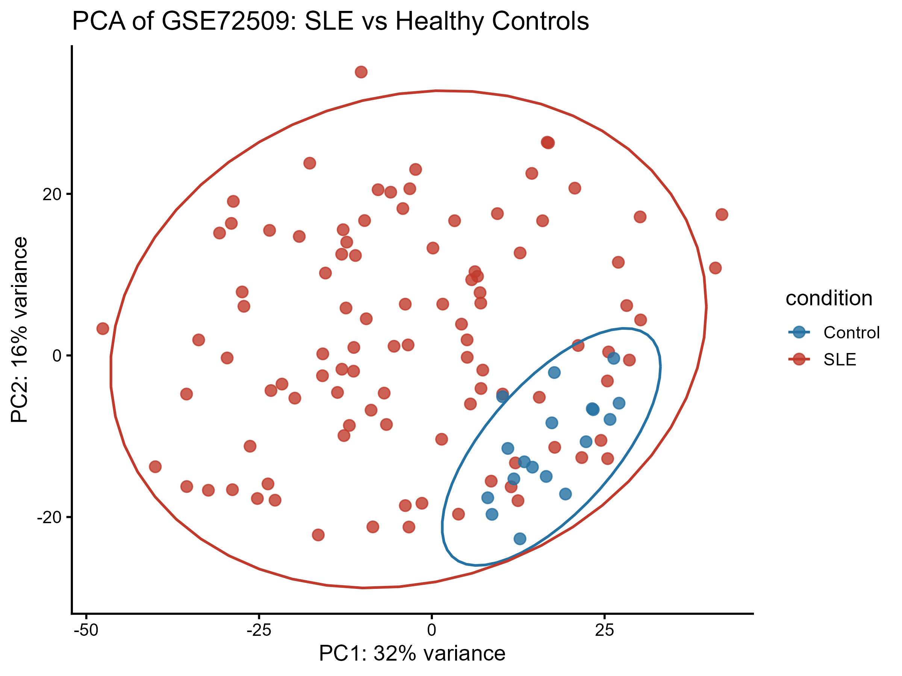
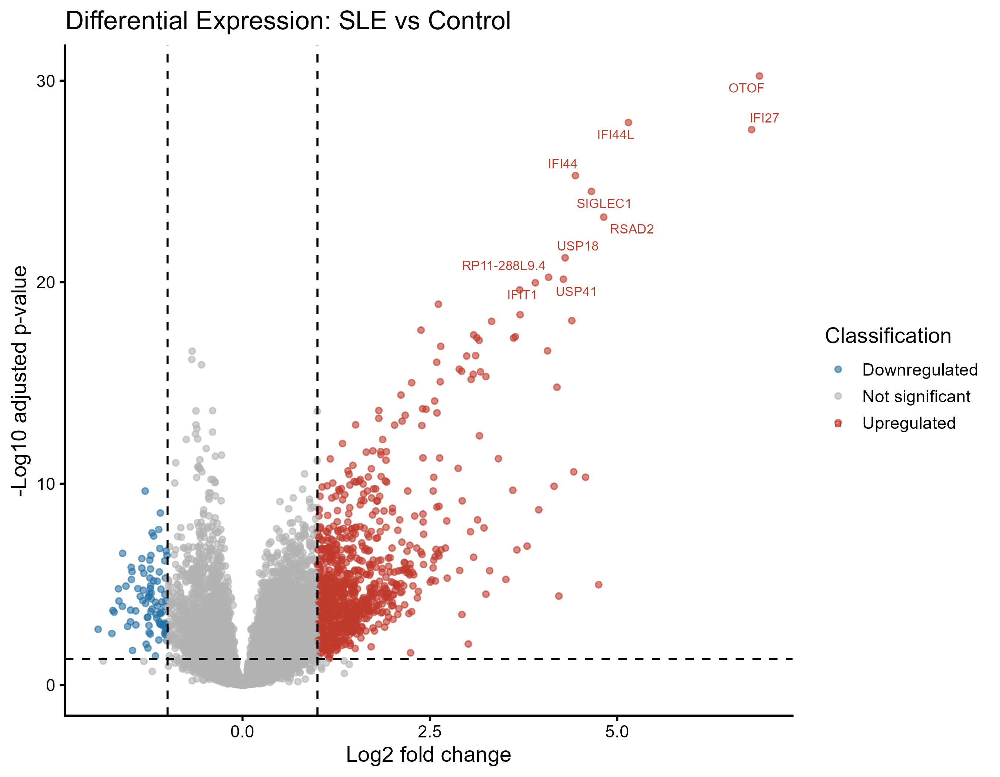
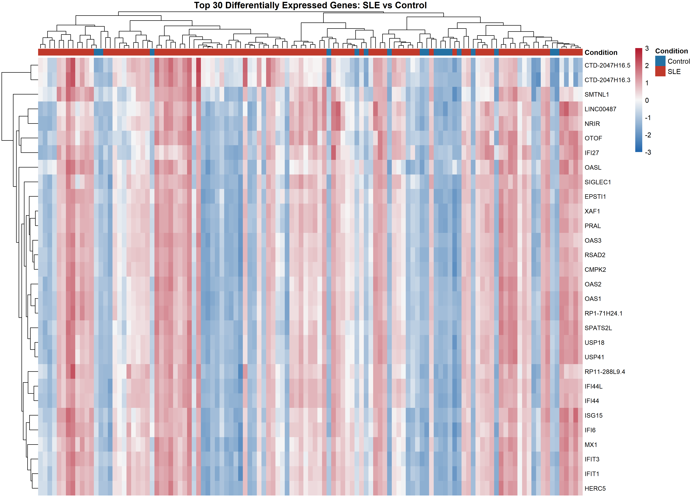
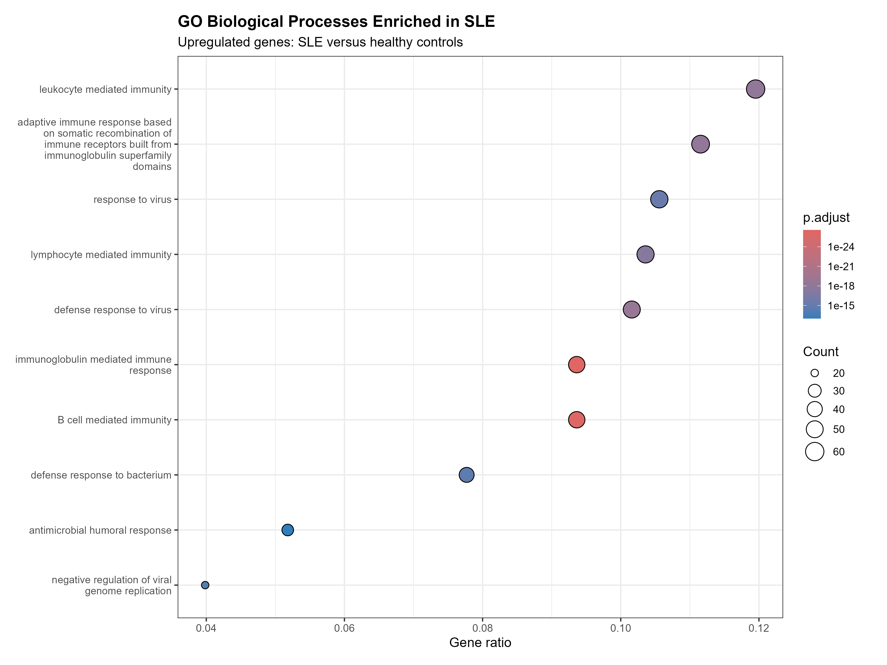
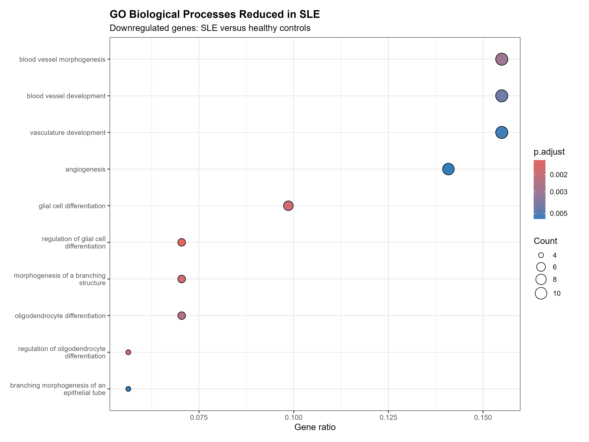

# Transcriptomic Analysis of Systemic Lupus Erythematosus

## Overview

This project presents a reproducible reanalysis of the public whole-blood RNA-seq dataset GSE72509 (SRA: SRP062966). Gene expression was compared between patients with systemic lupus erythematosus (SLE) and healthy controls.

## Dataset

- Total samples: 117
- SLE samples: 99
- Healthy controls: 18
- Tissue: whole blood
- Data source: [NCBI GEO GSE72509](https://www.ncbi.nlm.nih.gov/geo/query/acc.cgi?acc=GSE72509)
- Original publication: [Ro60, Alu RNAs and type I interferon in SLE](https://pubmed.ncbi.nlm.nih.gov/26382853/)

## Analysis workflow

1. Downloaded gene-level RNA-seq data using recount3.
2. Retrieved and cleaned sample metadata.
3. Assigned samples to SLE and healthy-control groups.
4. Filtered genes with insufficient expression.
5. Applied variance-stabilising transformation.
6. Assessed sample variation using PCA.
7. Performed differential-expression analysis with DESeq2.
8. Created PCA, volcano and clustered heatmap visualisations.
9. Performed GO Biological Process enrichment analysis.

## Statistical thresholds

- Adjusted p-value: less than 0.05
- Absolute log2 fold change: at least 1
- Multiple-testing correction: Benjamini-Hochberg
- GO background: all tested genes successfully mapped to Entrez identifiers

## Main results

- Genes tested: 23528
- Significant genes: 959
- Upregulated genes: 873
- Downregulated genes: 86
- Significant upregulated GO processes: 220
- Significant downregulated GO processes: 37
- PCA explained 32% of variation on PC1 and 16% on PC2.
- SLE samples displayed greater transcriptomic heterogeneity than controls.
- Strongly altered genes included IFI27, IFI44, IFI44L, SIGLEC1, RSAD2, USP18, OAS1, OAS2, OAS3, ISG15, MX1 and HERC5.
- Upregulated pathways were dominated by antiviral response, interferon-associated activity, B-cell immunity, immunoglobulin-mediated immunity and leukocyte-mediated immunity.
- Downregulated enrichment included vascular-development and angiogenesis-related processes.

## Principal interpretation

The analysis identifies a strong interferon-stimulated and antiviral-like transcriptional programme in SLE whole blood, accompanied by B-cell and immunoglobulin-associated immune activation. The response-to-virus terminology represents host immune-response genes and does not by itself demonstrate the presence of viral infection.

## Figures

### Principal component analysis

### Differential expression

### Top differentially expressed genes

### Upregulated biological processes

### Downregulated biological processes

## Limitations

- The SLE and control groups are unequal in size.
- Whole-blood expression can be influenced by differences in blood-cell composition.
- The model does not adjust for treatment, disease activity, age, sex or other potential confounders.
- GO terms often share genes and should not be interpreted as independent biological mechanisms.
- This is an exploratory reanalysis of one public cohort and is not a diagnostic test.

## Reproducibility

Run the numbered R scripts in order. Package and system versions used for the analysis are provided in `session_info.txt`.

## Author

Ali Hamza Bilal
